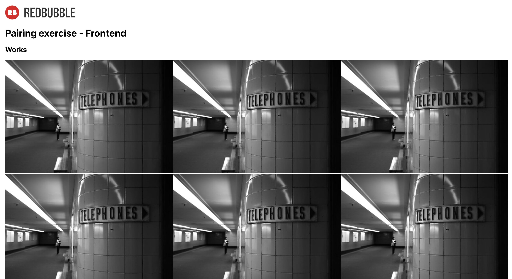

# Rebubble Frontend Code Pairing Exercise

## Context
The code under the `/frontend` folder will be used as a basis for our frontend pairing exercise.
In the interview we'll talk through an extension and your thoughts on design and how you might evolve it.

## Interview prep
* Clone this repo. For the frontend interview you'll be working with the app in the `/frontend` folder.
* Set up the app in your IDE of choice. You'll be sharing your screen during the pairing interview.
* Make sure you can run `yarn start` and `yarn test` successfully before your interview.

**If you can see the following content on your browser you are good to go!**

